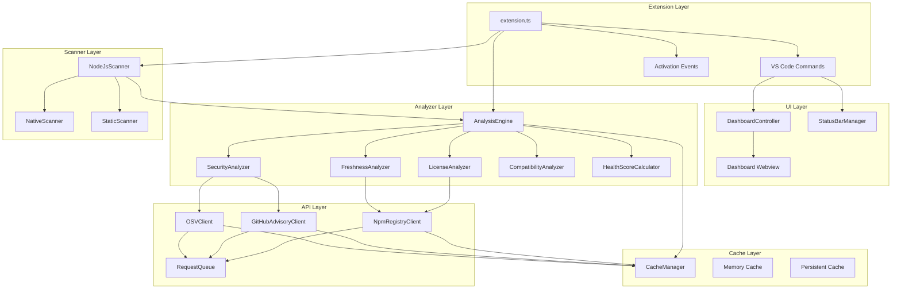
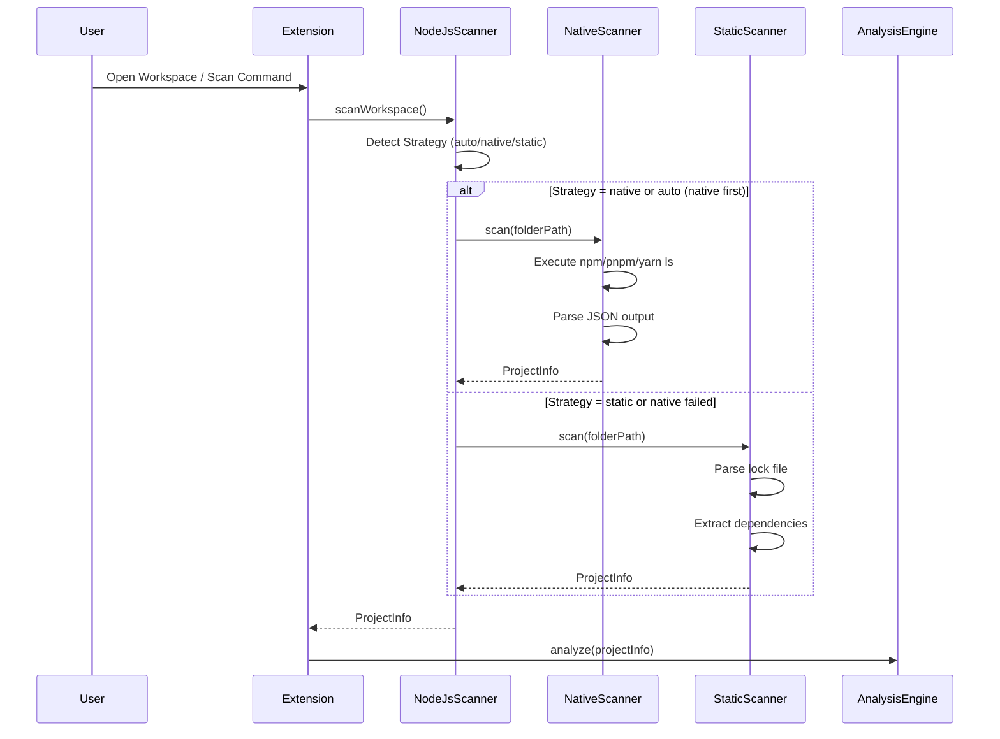
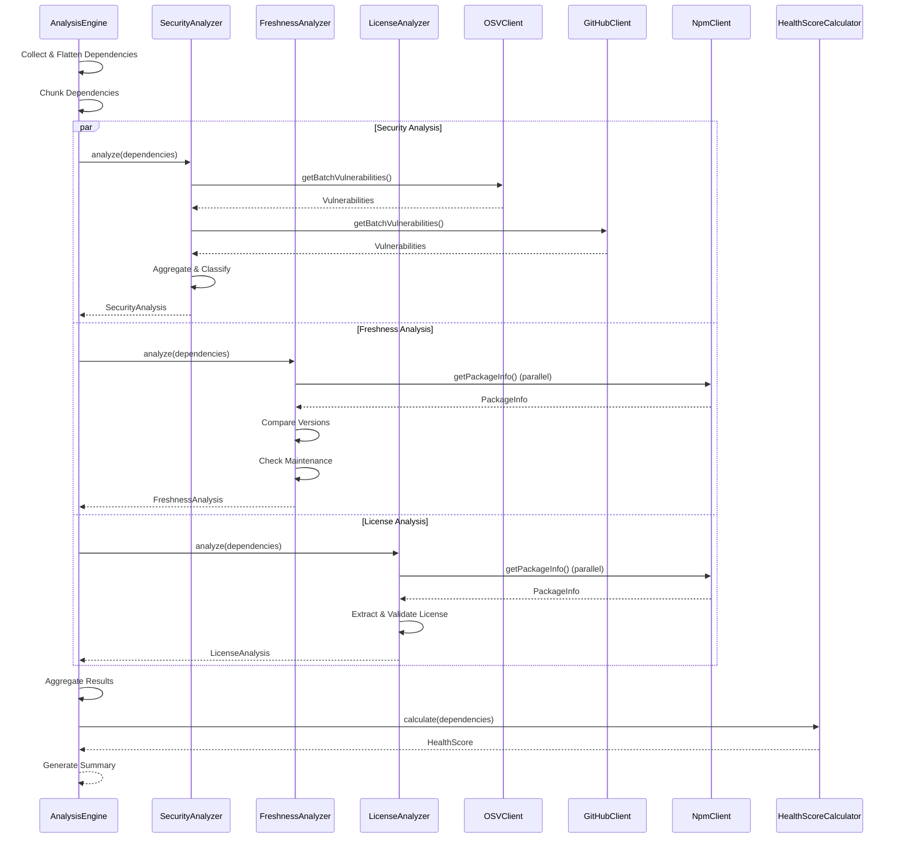
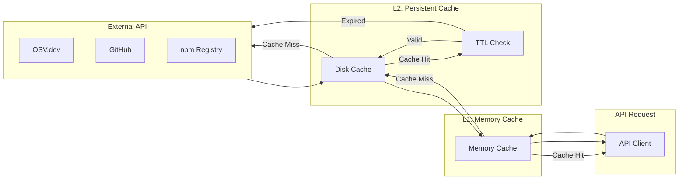
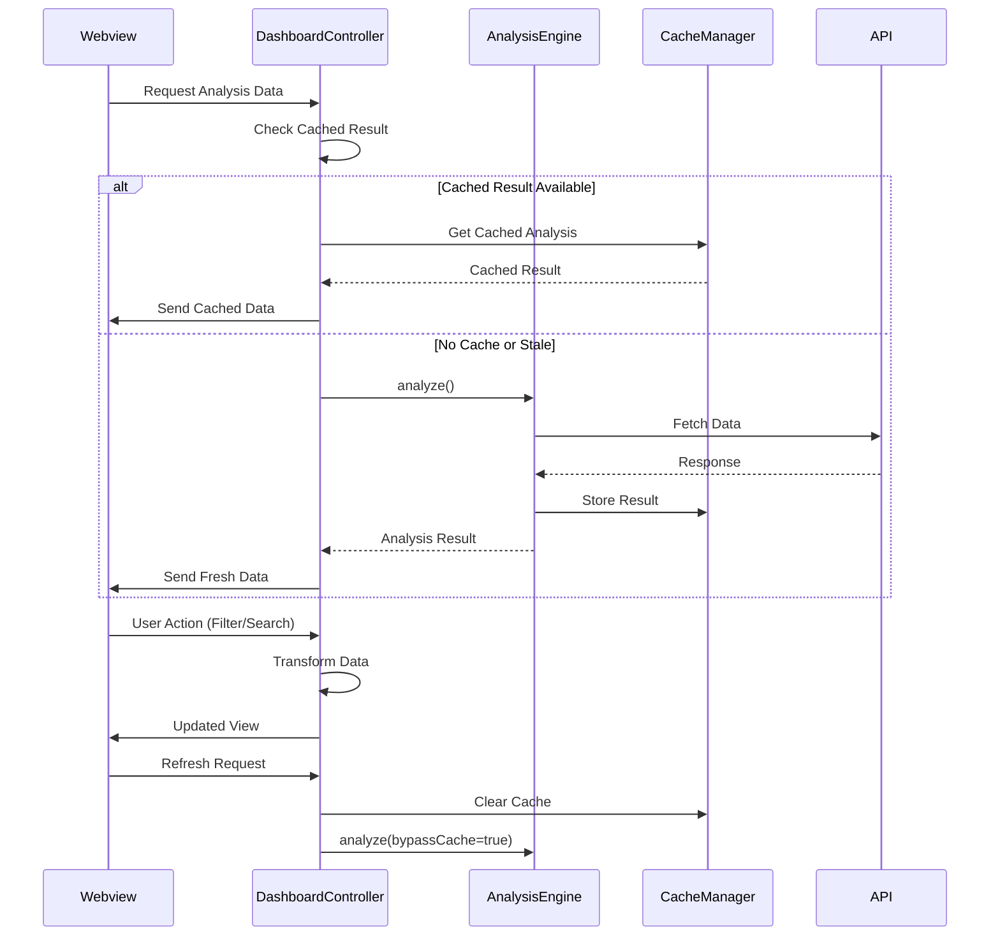
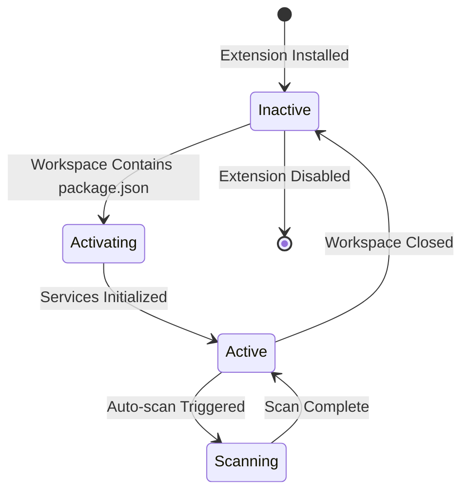

# DepPulse Technical Documentation

## Table of Contents

1. [Overview](#overview)
2. [System Architecture](#system-architecture)
3. [Component Breakdown](#component-breakdown)
4. [Data Flow](#data-flow)
5. [Technical Specifications](#technical-specifications)
6. [Performance Considerations](#performance-considerations)
7. [Extension Lifecycle](#extension-lifecycle)
8. [Configuration System](#configuration-system)
9. [Error Handling](#error-handling)
10. [API Integrations](#api-integrations)

## Overview

DepPulse is a VS Code extension that provides comprehensive dependency health analysis for JavaScript/TypeScript projects. It analyzes dependencies across multiple dimensions: security vulnerabilities, package freshness, license compliance, and compatibility.

### Key Design Principles

- **Modularity**: Clear separation of concerns across layers
- **Performance**: Efficient caching and chunked processing for large projects
- **Reliability**: Graceful error handling and offline support
- **Extensibility**: Easy to add new analyzers or data sources
- **User Experience**: Fast, responsive UI with real-time updates

## System Architecture

### High-Level Architecture



### Layer Responsibilities

1. **Extension Layer**: VS Code integration, command registration, lifecycle management
2. **UI Layer**: User interface components (dashboard, status bar)
3. **Analyzer Layer**: Core analysis logic (security, freshness, license, compatibility)
4. **API Layer**: External service clients (OSV, GitHub, npm registry)
5. **Scanner Layer**: Dependency detection and parsing
6. **Cache Layer**: Multi-tier caching system

## Component Breakdown

### Scanner Layer

#### NodeJsScanner

The main scanner facade that coordinates scanning strategies.

**Responsibilities**:
- Detects workspace type (monorepo vs monolith)
- Selects appropriate scanning strategy (auto/native/static)
- Handles fallback logic
- Aggregates results from multiple package.json files

**Key Methods**:
- `scanWorkspace()`: Main entry point for scanning

#### NativeScanner

Uses package manager CLI (npm/pnpm/yarn) for accurate dependency resolution.

**Advantages**:
- Most accurate (uses actual lock files)
- Handles workspace hoisting correctly
- Resolves transitive dependencies accurately

**Limitations**:
- Requires package manager to be installed
- Requires `node_modules` to be present (or runs install)
- Slower than static parsing

**Implementation**:
- Executes `npm ls --json` or equivalent
- Parses JSON output
- Handles monorepo workspaces

#### StaticScanner

Parses lock files directly without executing package manager.

**Advantages**:
- Fast (no CLI execution)
- Works offline
- No dependency on package manager installation

**Limitations**:
- Less accurate for complex scenarios
- May miss workspace-specific resolutions
- Requires lock file to exist

**Supported Formats**:
- `package-lock.json` (npm)
- `pnpm-lock.yaml` (pnpm)
- `yarn.lock` (Yarn)

### API Layer

#### OSVClient

Client for OSV.dev (Open Source Vulnerabilities) API.

**Features**:
- HTTP/2 support for improved performance
- Batch query support (hybrid batching strategy)
- No API key required
- No rate limits

**Batch Strategy**:
1. Query `/v1/querybatch` to get vulnerability IDs
2. Fetch full details for unique IDs using `/v1/vulns/{id}`
3. Cache vulnerability details to avoid redundant fetches

**Connection Pooling**:
- Dynamic pool size based on project size
- Small projects (10-50 deps): 10 connections
- Mid projects (50-200 deps): 25 connections
- Large projects (200+ deps): 50 connections

#### GitHubAdvisoryClient

Client for GitHub Security Advisory Database API.

**Features**:
- GHSA and CVE identifiers
- CVSS scoring
- Optional authentication (higher rate limits with token)

**Rate Limits**:
- Without token: 60 requests/hour
- With token: 5,000 requests/hour

**Batch Processing**:
- Optimal batch size: 500 packages
- URL length limit: 8,000 characters
- Automatic batching for large projects

#### NpmRegistryClient

Client for npm registry API.

**Features**:
- Package metadata retrieval
- Latest version lookup
- Download statistics
- Repository information

**Endpoints Used**:
- `GET /{package}`: Full package metadata
- `GET /{package}/latest`: Latest version only

### Analyzer Layer

#### AnalysisEngine

Coordinates all analysis components and manages the analysis lifecycle.

**Responsibilities**:
- Dependency collection and flattening
- Chunked processing for large projects
- Parallel execution of analyzers
- Result aggregation
- Progress reporting

**Processing Flow**:
1. Collect all dependencies (direct + transitive if enabled)
2. Flatten dependency tree (monorepo-aware deduplication)
3. Process in chunks (configurable chunk size, default: 50)
4. Run analyzers in parallel:
   - Security analysis
   - Freshness analysis
   - License analysis
   - Compatibility analysis
5. Calculate health scores
6. Generate summary

#### SecurityAnalyzer

Analyzes dependencies for security vulnerabilities.

**Input**: List of dependencies with versions
**Output**: Security analysis with vulnerabilities and severity

**Process**:
1. Query vulnerability sources (OSV/GitHub)
2. Match vulnerabilities to package versions using semver
3. Classify severity (critical/high/medium/low)
4. Aggregate results from multiple sources

**Severity Classification**:
- Critical: CVSS 9.0+ or critical severity
- High: CVSS 7.0-8.9 or high severity
- Medium: CVSS 4.0-6.9 or medium severity
- Low: CVSS < 4.0 or low severity

#### FreshnessAnalyzer

Analyzes package freshness and maintenance status.

**Input**: Dependencies with versions, npm registry data
**Output**: Freshness analysis with outdated status

**Checks**:
1. **Latest Version**: Compare installed vs latest
2. **Version Gap**: Calculate major/minor/patch gap
3. **Last Update**: Check last publish date
4. **Unmaintained**: Flag if no updates for threshold period

**Classification**:
- Unmaintained: No updates for 730+ days (configurable)
- Major Outdated: New major version available (with grace period)
- Minor Outdated: New minor version available
- Patch Outdated: New patch version available
- Up to Date: Latest version installed

#### LicenseAnalyzer

Extracts and analyzes package licenses.

**Process**:
1. Extract license from package.json
2. Normalize license identifiers (SPDX format)
3. Check compatibility with project license
4. Validate against acceptable licenses list

**License Sources**:
1. `package.json.license` field
2. `package.json.licenses` array (legacy)
3. `LICENSE` file (if available)

#### HealthScoreCalculator

Calculates weighted health scores for dependencies.

**Formula**:
```
Overall Score = (Security × W_security) + 
                (Freshness × W_freshness) + 
                (Compatibility × W_compatibility) + 
                (License × W_license)
```

**Default Weights**:
- Security: 40%
- Freshness: 30%
- Compatibility: 20%
- License: 10%

**Component Scores**:
- Each component scored 0-100
- Security: Based on vulnerability severity and count
- Freshness: Based on outdated status and maintenance
- Compatibility: Based on version compatibility
- License: Based on license compliance

### Cache Layer

#### CacheManager

Multi-tier caching system for performance optimization.

**Cache Tiers**:

1. **Memory Cache (L1)**:
   - Fastest access
   - Cleared on extension restart
   - Used for frequently accessed data

2. **Persistent Cache (L2)**:
   - Stored on disk
   - Survives extension restarts
   - TTL-based expiration

**Cached Data Types**:
- npm package metadata
- OSV vulnerabilities
- GitHub vulnerabilities
- Analysis results

**Cache Strategy**:
- **Normal vulnerabilities**: TTL-based (default: 60 minutes)
- **Critical/High vulnerabilities**: No cache (always fresh)
- **Package metadata**: Longer TTL (changes infrequently)
- **Analysis results**: Short TTL (dependencies may change)

**Cache Invalidation**:
- TTL expiration
- Force refresh command
- Dependency file changes
- Configuration changes

## Data Flow

### Dependency Scanning Flow



### Analysis Pipeline Flow



### Cache Flow Diagram



### Webview Communication Flow



## Technical Specifications

### Supported Package Managers

| Package Manager | Detection | Lock File Parsing | Native CLI | Workspace Support |
|----------------|-----------|-------------------|------------|------------------|
| npm | ✅ | ✅ (package-lock.json) | ✅ | ✅ |
| pnpm | ✅ | ✅ (pnpm-lock.yaml) | ✅ | ✅ |
| Yarn | ✅ | ✅ (yarn.lock) | ✅ | ✅ |

### Scanning Strategies

#### Auto Strategy (Default)

1. Attempt native scanning first
2. Fallback to static if native fails
3. Fallback reasons:
   - Network errors
   - Missing dependencies
   - Package manager not installed

#### Native Strategy

- Uses package manager CLI
- Most accurate
- Requires `node_modules` or runs install
- Slower but handles edge cases

#### Static Strategy

- Parses lock files directly
- Fast and works offline
- Less accurate for complex scenarios
- Requires lock file to exist

### Caching Strategy

#### Cache TTL Configuration

| Data Type | Default TTL | Configurable Range | Critical Bypass |
|-----------|-------------|-------------------|-----------------|
| OSV Vulnerabilities | 60 min | 15-120 min | ✅ Yes |
| GitHub Vulnerabilities | 60 min | 15-120 min | ✅ Yes |
| npm Package Info | 24 hours | N/A | ❌ No |
| Analysis Results | 5 min | N/A | ❌ No |

#### Cache Invalidation Triggers

1. TTL expiration
2. Force refresh command
3. Dependency file changes (package.json, lock files)
4. Configuration changes (weights, thresholds)
5. Critical vulnerability detection (bypasses cache)

### Health Score Calculation

#### Component Scoring

**Security Score (0-100)**:
- 100: No vulnerabilities
- 90-99: Low severity vulnerabilities
- 70-89: Medium severity vulnerabilities
- 50-69: High severity vulnerabilities
- 0-49: Critical vulnerabilities

**Freshness Score (0-100)**:
- 100: All packages up to date
- 80-99: Some patch updates available
- 60-79: Some minor updates available
- 40-59: Some major updates available
- 0-39: Unmaintained packages

**Compatibility Score (0-100)**:
- Based on version compatibility checks
- Node.js version compatibility
- Peer dependency compatibility

**License Score (0-100)**:
- 100: All licenses acceptable
- 0: Incompatible licenses detected

#### Weighted Formula

```typescript
overallScore = Math.round(
  securityScore * weights.security +
  freshnessScore * weights.freshness +
  compatibilityScore * weights.compatibility +
  licenseScore * weights.license
)
```

### API Rate Limits

| Service | Without Auth | With Auth | Notes |
|---------|-------------|-----------|-------|
| OSV.dev | Unlimited | N/A | No authentication required |
| GitHub | 60/hour | 5,000/hour | Token recommended |
| npm Registry | 42/min | N/A | IP-based rate limiting |

## Performance Considerations

### Chunked Processing

Large projects are processed in chunks to:
- Reduce memory usage
- Provide progress feedback
- Handle errors gracefully
- Allow cancellation

**Default Chunk Size**: 50 dependencies
**Configurable Range**: 10-200 dependencies

### Connection Pooling

Dynamic connection pool sizing based on project size:
- Small projects (<50 deps): 10 connections
- Medium projects (50-200 deps): 25 connections
- Large projects (>200 deps): 50 connections

### Memory Management

- Chunked processing prevents memory spikes
- Cache size limits prevent unbounded growth
- Disposable pattern for cleanup
- Weak references where appropriate

### Network Optimization

- HTTP/2 multiplexing (OSV.dev)
- Batch queries reduce round trips
- Request queue prevents overwhelming APIs
- Retry logic with exponential backoff

## Extension Lifecycle

### Activation



### Activation Events

- `workspaceContains:**/package.json`: Activates when workspace contains package.json

### Service Initialization Order

1. Logger
2. Cache Manager
3. API Clients (OSV, GitHub, npm)
4. Request Queue
5. Scanners
6. Analyzers
7. Analysis Engine
8. UI Components (Dashboard, Status Bar)
9. Configuration Listeners

### Disposal

Services are disposed in reverse order:
1. Configuration Listeners
2. UI Components
3. Analysis Engine
4. Analyzers
5. Scanners
6. Request Queue
7. API Clients
8. Cache Manager
9. Logger

## Configuration System

### Configuration Sources

1. **VS Code Settings**: User/workspace settings
2. **Secrets Storage**: VS Code secret storage (API keys)

### Configuration Categories

#### Analysis Configuration

- `depPulse.analysis.strategy`: Scanning strategy
- `depPulse.analysis.autoScanOnStartup`: Auto-scan on startup
- `depPulse.analysis.scanOnSave`: Auto-scan on file save
- `depPulse.analysis.includeTransitiveDependencies`: Include transitive deps
- `depPulse.analysis.chunkSize`: Chunk size for processing

#### Vulnerability Detection

- `depPulse.vulnerabilityDetection.primarySource`: Primary source (osv/github)
- `depPulse.cache.vulnerabilityTTLMinutes`: Cache TTL
- `depPulse.cache.bypassCacheForCritical`: Bypass cache for critical

#### Freshness Thresholds

- `depPulse.freshness.unmaintainedThresholdDays`: Unmaintained threshold
- `depPulse.freshness.majorVersionGracePeriodDays`: Major version grace period

#### Health Score Weights

- `depPulse.healthScore.weights.security`: Security weight
- `depPulse.healthScore.weights.freshness`: Freshness weight
- `depPulse.healthScore.weights.compatibility`: Compatibility weight
- `depPulse.healthScore.weights.license`: License weight

#### License Configuration

- `depPulse.licenses.acceptableLicenses`: Array of acceptable licenses
- `depPulse.licenses.strictMode`: Strict mode flag
- `depPulse.licenses.projectLicense`: Project license identifier

### Configuration Change Detection

Configuration changes trigger:
1. Re-initialization of affected services
2. Cache invalidation (if relevant)
3. Re-analysis (if weights/thresholds changed)

## Error Handling

### Error Types

1. **Network Errors**: Handled with retry logic and fallback
2. **API Errors**: Rate limit handling, error messages
3. **Parsing Errors**: Graceful degradation, error reporting
4. **Configuration Errors**: Validation and user feedback

### Offline Mode

When offline:
1. Check cache coverage
2. Serve cached data if available
3. Show offline indicator in dashboard
4. Allow force refresh when online

### Error Recovery

- Automatic retry with exponential backoff
- Fallback to alternative data sources
- Partial results (continue on individual failures)
- User-friendly error messages

## API Integrations

### OSV.dev API

**Base URL**: `https://api.osv.dev`

**Endpoints**:
- `POST /v1/querybatch`: Batch vulnerability query
- `GET /v1/vulns/{id}`: Get vulnerability details

**Features**:
- HTTP/2 support
- No authentication required
- No rate limits
- Comprehensive CVE coverage

### GitHub Advisory API

**Base URL**: `https://api.github.com`

**Endpoints**:
- `POST /graphql`: GraphQL query for advisories
- `GET /advisories`: REST endpoint (limited)

**Authentication**:
- Optional Bearer token
- Higher rate limits with token

### npm Registry API

**Base URL**: `https://registry.npmjs.org`

**Endpoints**:
- `GET /{package}`: Package metadata
- `GET /{package}/latest`: Latest version

**Rate Limits**:
- 42 requests per minute per IP
- No authentication required
